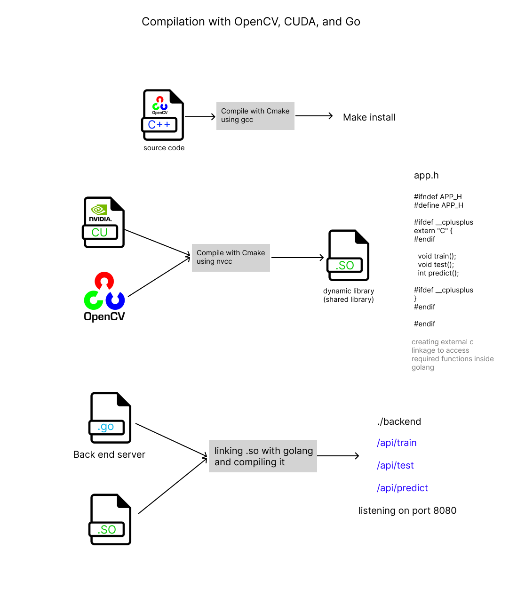

# end to end kidney tumor classification with cuda C++
 
Welcome to the repository for my cutting-edge kidney tumor classification system! This project represents the culmination of my efforts, leveraging CUDA C++ and OpenCV to develop a sophisticated neural network for accurately classifying kidney tumors. Through extensive work, I have created a system that seamlessly integrates with a Golang server and is complemented by a React-powered frontend. Deployment on Azure AKS with GitHub Actions ensures streamlined deployment and management.

## Features

- **CUDA C++ Neural Network:** At the core of this system is a robust neural network implemented entirely in CUDA C++, enabling efficient parallel processing and leveraging the power of GPUs for accelerated computations.

- **Golang Server Integration:** The neural network seamlessly integrates with a Golang server, facilitating smooth communication between the backend and frontend components.

- **React Frontend:** The frontend interface, powered by React, offers users an intuitive and interactive experience, allowing them to interact with the classification system effortlessly.

- **Deployment on Azure AKS:** Leveraging Azure AKS (Azure Kubernetes Service) for deployment ensures scalability, reliability, and ease of management, providing a robust infrastructure for hosting the system.

- **GitHub Actions Deployment:** The deployment process is streamlined using GitHub Actions, enabling continuous integration and deployment with minimal manual intervention.

# Prerequisite Knowledge
1. C++ Programming
2. CUDA Programming
3. Neural Networks (CNN2d, maxpool2d, liner, relu, sigmoid, batch normalization, flatten layer)
4. OpenCV
5. Server-side Development (basic golang)
6. Frontend Development (basic react.js)
7. Containerization and Orchestration (docker and kubernetes)
8. Azure
9. Continuous Integration/Continuous Deployment (Github actions)

    
# Neural network architecture

<p align="center">
  
</p>

The image shows a neural network architecture for image classification. The network takes an input image of size 225x225 and outputs a probability distribution over the possible classes. The network consists of several layers, including convolutional layers, ReLU activation layers, max-pooling layers, batch normalization layers, a flatten layer, linear layers, and a sigmoid activation layer.

The convolutional layers extract features from the input image. The ReLU activation layers introduce non-linearity into the network. The max pooling layers downsample the feature maps. The batch normalization layers normalize the activations. The flatten layer converts the feature maps into a single vector. The linear layers learn to classify the input image based on this vector. The sigmoid activation layer outputs a probability distribution over the possible classes.

# Compilation

<p align="center">
  
</p>

note: For learning purposes, I am building OpenCV from the source. If you want you can install  it by **apt-get install libopencv-dev**

1. C++ Compilation: Initially, the CMake configuration compiles the C++ sources and creates a shared library (.so file) named app using CUDA for GPU acceleration and OpenCV for computer vision functionalities. This library contains the CUDA-accelerated neural network components.

2. Go Compilation: After the C++ compilation is completed, the CMake configuration invokes the Go compiler to compile the Go source file (app.go). The resulting executable is named backend.

3. Linking C++ Library with Go Executable: During the Go compilation step, the Go program (backend) is linked with the previously compiled C++ shared library (app.so). This linking allows the Go program to utilize the functionalities provided by the C++ library.

# How to run this?

## locally 
Locally you need docker and docker compose. And Nvidia GPU with cuda v12.2

```
docker-compose -f docker-compose.build.yml build
```
you have to wait.

```
docker-compose -f docker-compose.build.yml up
```

web app will start on http://localhost:3000/. However, you still need to wait for the completion of the neural network training process.
you can find kidney images inside " ./NN_backend/cuda_nn/kidney-ct-scan-image ".

## Azure
I've developed a comprehensive CI/CD pipeline using GitHub Actions to seamlessly deploy applications onto the Azure cloud.
workflow dir "./github/workflows/"

### Required credentials
1. AZURE_CLIENT_ID
2. AZURE_TENANT_ID
3. AZURE_SUBSCRIPTION_ID
4. ACR_USERNAME
5. ACR_PASSWORD

Please refer to the following link for instructions on obtaining the necessary credentials. 

[azure-login#workflow-examples](https://github.com/marketplace/actions/azure-login#workflow-examples)
 
I used a service principal to enable authentication, and then employed OIDC methods for the login process.

In Azure, I created an application within the "App Registrations" section and assigned it the owner role with constrained permissions. Specifically, this application is only permitted to assign the AcrPull role to other resources.

